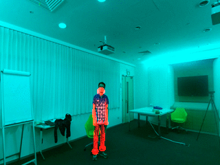
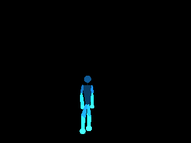

# Code and Models for "Chained Multi-stream Networks Exploiting Pose, Motion, and Appearance for Action Classification and Detection" in ICCV 2017 

By Mohammadreza Zolfaghari, Gabriel L. Oliveira, Nima Sedaghat, Thomas Brox


### Update
- **2018.2.26**: The pretrained models and scripts for creating human pose maps are released.

### Contents
0. [Introduction](#introduction)
0. [Citation](#citation)
0. [Requirements](#requirements)
0. [Installation](#installation)
0. [Usage](#usage)
0. [Models](#models)
0. [Results](#results)
0. [Project page](#Project page)


### Introduction
This repository will contains all the required models and scripts for the paper "Chained Multi-stream Networks Exploiting Pose, Motion, and Appearance for Action Classification and Detection".

ChainedNet is a recently proposed action recognition method. It was initially described in an [arXiv technical report](https://arxiv.org/abs/1704.00616) and then published in [ICCV 2017](http://openaccess.thecvf.com/content_ICCV_2017/papers/Zolfaghari_Chained_Multi-Stream_Networks_ICCV_2017_paper.pdf). 

In this work, we propose a network architecture that computes and integrates the most important visual cues for action recognition: pose, motion, and the raw images. For the integration, we introduce a Markov chain model which adds cues successively. The resulting approach is efficient and applicable to action classification as well as to spatial and temporal action localization. If our proposed architectures also help your research, please consider to cite our paper.

We also proposed to compute the position of human body parts with a fast convolutional network. This combination can capture temporal dynamics of body parts over time, which is valuable to improve action recognition performance, as we show in dedicated experiments. The pose network also yields the spatial localization of the persons, which allows us to apply the approach to spatial action localization in a straightforward manner.


### Citation

If you find **ChainedNet** useful in your research, please consider to cite:

        @InProceedings{ZOSB17a,
        author       = "Mohammadreza Zolfaghari and
                    Gabriel L. Oliveira and
                    Nima Sedaghat and
                    Thomas Brox",
        title        = "Chained Multi-stream Networks Exploiting Pose, Motion, and Appearance for Action Classification and Detection",
        booktitle    = "IEEE International Conference on Computer Vision (ICCV)",
        month        = " ",
        year         = "2017",
        url          = "http://lmb.informatik.uni-freiburg.de/Publications/2017/ZOSB17a"
        }


### Requirements
1. Requirements for `Python`
2. Requirements for `Matlab`
3. Requirements for `Caffe` and `pycaffe` (see: [Caffe installation instructions](http://caffe.berkeleyvision.org/installation.html))

### Installation
1. git clone ... TODO.
2. Build Caffe and pycaffe

    ```Shell
    cd $caffe_FAST_ROOT/
    # Now follow the Caffe installation instructions here:
    # http://caffe.berkeleyvision.org/installation.html
    make all -j8 && make pycaffe && make matcaffe
    ```

### Usage

*After successfully completing the [installation](#installation)*, you are ready to run all the following experiments.

#### Part 1: Body Part Segmentation
 Please follow steps explained in [Body Part Segmentation](https://github.com/mzolfaghari/chained-multistream-networks/tree/master/body_part_segmentation)

Image+mask             |  BodyPart mask
:-------------------------:|:-------------------------:
  |  


#### Part 2: Chained Multi-stream network
**Note:** TODO


### Models (TODO)


### Results (TODO)


### Project page
https://lmb.informatik.uni-freiburg.de/projects/action_chain/


### Contact

  [Mohammadreza Zolfaghari](https://github.com/mzolfaghari/chained-multistream-networks)

  Questions can also be left as issues in the repository. We will be happy to answer them.
